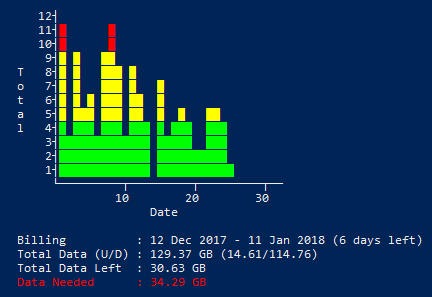

# MyAussiebroadBand Usage Script

[Aussie Broadband](https://www.aussiebroadband.com.au/) is an Australian based ISP.  They have the usual web page which displays your data usage but there's no mobile app or even API to query so you can get this information, other than manually logging in.  Some people have created Chrome or Firefox extensions to get this data but I wanted something in PowerShell.

This PowerShell script will log into the [My Aussie](https://my.aussiebroadband.com.au/) portal, extract the usage data and then display a pretty graph, all without leaving a PowerShell console.

This script uses two handy modules.

1. [PSConsoleGraph](https://github.com/PrateekKumarSingh/PSConsoleGraph) by [Prateek Singh](https://github.com/PrateekKumarSingh).  Unfortunately this wasn't on the PS Gallery, so I've copied the source into my script - PLEASE prod/poke/pester Prateek to publish this!

2. [PSSecret](https://www.powershellgallery.com/packages/PSSecret/1.0.0) by [Kiran Reddy](https://github.com/v2kiran).  This is used to store your ISP logon details somewhat securely

## Scripts

### Get-MyAussieBroadbandUsage.ps1

#### Parameters

* `-Username` : Username to log into the My Aussie portal

* `-Password` : Password to log into the My Aussie portal

#### Output

Displays the broadband usage for your current billing cycle



It also displays how much data you have left, and how much data you'll probably need by the end of your billing cycle (Red colour is bad, Green is good!)


### Invoke-MyAussieBroadbandusage.ps1

#### Parameters

* `-Username`        : Username to log into the My Aussie portal

* `-Password`        : Password to log into the My Aussie portal

* `-SaveCredentials` : A Switch that when enabled will save your credentials for later use

The `Invoke-MyAussieBroadbandusage` script will load saved credentials if none were passed, otherwise the Username and Password parameters will take precedence.  By default credentials will not saved.

The script will then run the `Get-MyAussieBroadbandUsage.ps1` script with the supplied credentials.

Invoke-MyAussieBroadbandusage can be thought of as a credential wrapper around the Get-MyAussieBroadbandUsage script.

``` powershell
PS> .\Invoke-MyAussieBroadbandusage.ps1 -Username Glenn -Password Foo -SaveCredentials

... Shows the usage graph

PS> .\Invoke-MyAussieBroadbandusage.ps1

... Shows the usage graph

PS>
```

The first time the script is called we save the credentials and the second time we call the script we no longer have to pass username or password.
